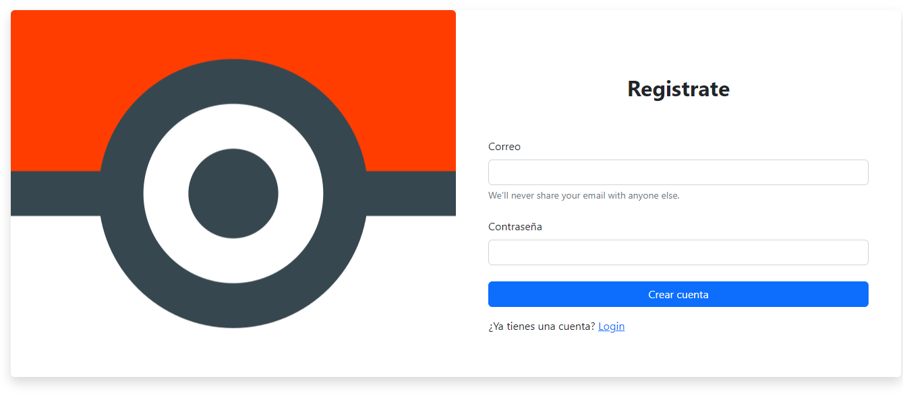

# HISTORIA DE USUARIO

---

Este proyecto es una aplicación web de Angular que tiene como objetivo crear una página de login con un diseño amigable y que se muestre solo a los usuarios autorizados. Para lo cual se creó un componente de creacion de usuario y otro de login. Donde si el usuario no tiene ninguna cuenta registrada puede registrar su correo. Si ya cuenta con una cuenta puede ir a la seccion LOGIN e ingresar su correo y contraseña para visualizar el contenido de la tabla.

## 


En el dashboard encontramos el listado de Pokemons y filtrarlos por nombre. Se incluye tambien un paginado que avanza de 5 en 5.


## Technologies

---

Las tecnologías usadas en esta app:

- [Angular](https://angular.io/): Version 15.0.3
- [Typescrypt](https://www.typescriptlang.org/): Version 4.8.4
- [Boostrap](https://getbootstrap.com/): Version 5
- [Firebase](https://firebase.google.com/): Version 7.5.0

## Installation

---

Como instalar esta app en tu ordenador.

```
$ git clone https://github.com/Carlos7847/Historia-de-usuario.git
$ cd ../path/to/the/file
$ npm install
$ npm start
```

## EXPLICACIÓN DEL TIEMPO USADO

---

Me tomé una semana para desarrollar el proyecto debido a la complejidad y la novedad de las tecnologías utilizadas. TypeScript, Angular y Firebase son tecnologías muy populares y potentes, pero también son nuevas para mí y requerían tiempo y esfuerzo para aprender y comprender cómo funcionan y cómo se pueden utilizar en este proyecto.

Además, durante el desarrollo del proyecto, me encontré con obstáculos y problemas que tuve que resolver, lo que requirió tiempo y esfuerzo adicional. Como problemas con la antiguedad de tutoriales que usaban otra version de Angular, lo mismo con Firebase.

En resumen, el tiempo que se tomó para desarrollar el proyecto fue necesario debido a la complejidad y la novedad de las tecnologías utilizadas, así como al esfuerzo requerido para superar obstáculos y asegurar una buena implementación del proyecto.
